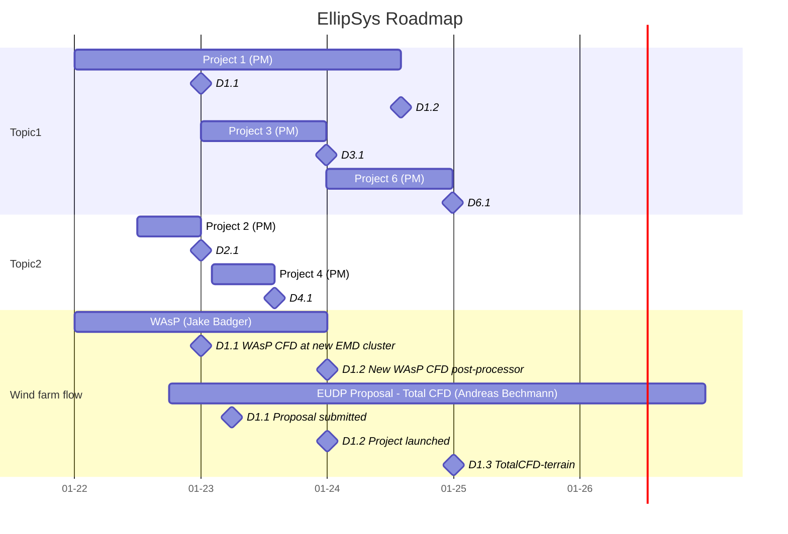

```mermaid
gantt
Title EllipSys Roadmap
dateFormat YYYY-MM-DD
axisFormat %m-%y
 
section Topic1
Project 1 (PM): p1, 2022-01-01, 2024-08-01
D1.1 : milestone, m11, 2023-01-01, 2min
D1.2 : milestone, m12, after p1, 2min
Project 3 (PM): p3, 2023-01-01, 52w
D3.1 : milestone, m31, after p3, 2min
Project 6 (PM): p6, after p3, 52w
D6.1 : milestone, m61, after p6, 2min

section Topic2
Project 2 (PM): p2, 2022-07-01, 2023-01-01
D2.1 : milestone, m21, after p2, 2min
Project 4 (PM): p4, 2023-02-01 , 26w
D4.1 : milestone, m41, after p4, 2min

section Wind farm flow
WAsP (Jake Badger) : waspcfd, 2022-01-01, 2024-01-01
D1.1 WAsP CFD at new EMD cluster : milestone, waspcfd_1, 2023-01-01, 2min
D1.2 New WAsP CFD post-processor : milestone, waspcfd_2, 2024-01-01, 2min
EUDP Proposal - Total CFD (Andreas Bechmann) : totalcfd, 2022-10-01, 2026-12-31
D1.1 Proposal submitted : milestone, totalcfd_1, 2023-04-01, 2min
D1.2 Project launched    : milestone, totalcfd_2, 2024-01-01, 2min
D1.3 TotalCFD-terrain : milestone, totalcfd_3, 2025-01-01, 2min
```
