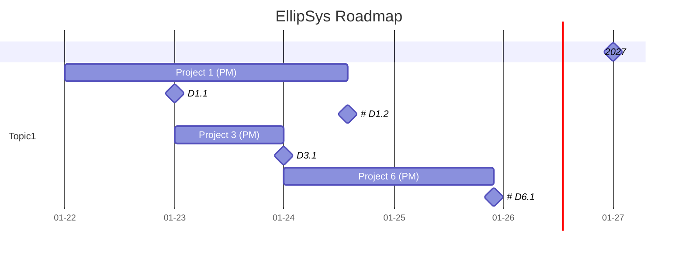

```mermaid
gantt
Title EllipSys Roadmap
dateFormat YYYY-MM-DD
axisFormat %m-%y

2027 : milestone, 5-years, 2027-01-01, 2min

section Topic1
Project 1 (PM): p1, 2022-01-01, 2024-08-01
D1.1 : milestone, m11, 2023-01-01, 2min
# D1.2 : milestone, m12, after p1, 2min
Project 3 (PM): p3, 2023-01-01, 52w
D3.1 : milestone, m31, after p3, 2min
Project 6 (PM): p6, after p3, 100w
# D6.1 : milestone, m61, after p6, 2min
```
