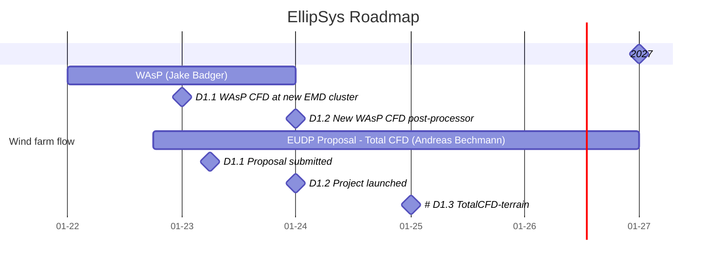

```mermaid
gantt
Title EllipSys Roadmap
dateFormat YYYY-MM-DD
axisFormat %m-%y

2027 : milestone, 5-years, 2027-01-01, 2min


section Wind farm flow
WAsP (Jake Badger) : waspcfd, 2022-01-01, 2024-01-01
D1.1 WAsP CFD at new EMD cluster : milestone, waspcfd_1, 2023-01-01, 2min
D1.2 New WAsP CFD post-processor : milestone, waspcfd_2, 2024-01-01, 2min
EUDP Proposal - Total CFD (Andreas Bechmann) : totalcfd, 2022-10-01, 2027-01-01
D1.1 Proposal submitted : milestone, totalcfd_1, 2023-04-01, 2min
D1.2 Project launched    : milestone, totalcfd_2, 2024-01-01, 2min
# D1.3 TotalCFD-terrain : milestone, totalcfd_3, 2025-01-01, 2min
```
